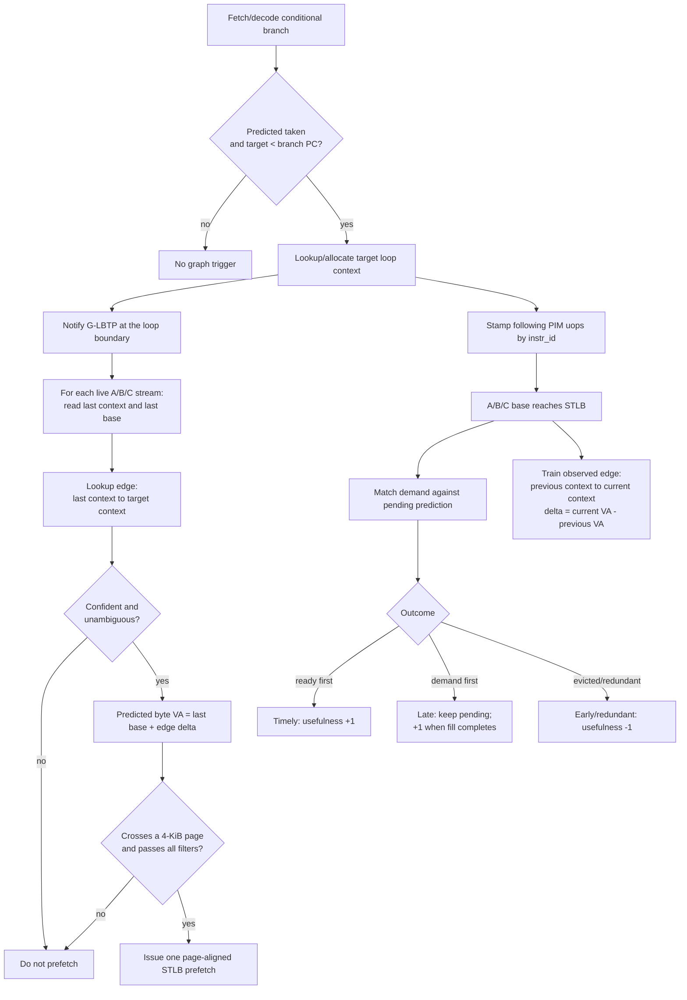

# G-LBTP dynamic-graph translation prefetcher

G-LBTP (Graph-based Loop-Boundary Translation Prefetcher) learns the causal
relationship between a fused PIM instruction's A/B/C base address and predicted
taken loop backedges. It consumes only the three instruction-carried base
addresses. Tile rows and page lists are not expanded inside the predictor.

## Graph model

A stream is identified by `(static PIM PC, operand role)`. The runtime loop
detector assigns a small context id to each predicted taken backward branch.
Context 0 means that no backedge is available.

For two consecutive accesses of one stream,

```text
previous = (source loop context, previous base)
current  = (target loop context, current base)
```

G-LBTP trains a directed edge:

```text
(stream, source loop PC) -> (target loop PC, current base - previous base)
```

The edge weight is a signed byte delta. Multiple ways retain different
target/delta modes for the same source. This matters at nested-loop boundaries,
where one source loop PC may usually return to the inner loop but occasionally
carry into an outer loop.

The selected-edge score is:

```text
score = 64 * confidence + occurrence_count + 8 * (usefulness + 4)
```

An edge must have confidence at least 2. If the best different-delta edge is
within 8 score points, prediction is suppressed as ambiguous. At most one
translation is prefetched per stream at a detected boundary.

## Microarchitecture

```mermaid
flowchart LR
  BP["Branch predictor / BTB"] --> LD["Taken-backedge detector"]
  LD --> CMT["Loop-context map<br/>loop PC to 3-bit context"]
  CMT --> TRIGGER["Boundary trigger<br/>target context"]
  CMT --> STAMP["instr_id context stamp"]

  BASE["PIM A/B/C base request<br/>PC + role + byte VA + instr_id"] --> DEDUP["Duplicate filter"]
  STAMP --> DEDUP
  DEDUP --> SNT["Stream Node Table<br/>128 entries"]
  DEDUP --> TRAIN["Transition trainer<br/>signed byte delta"]
  SNT --> TRAIN
  TRAIN --> GET["Graph Edge Table<br/>128 sets x 4 ways"]

  TRIGGER --> SCAN["Active A/B/C stream scan<br/>last context + last base"]
  SNT --> SCAN
  SCAN --> GET
  GET --> SCORE["Target-context match<br/>confidence / frequency / usefulness"]
  SCORE --> GATE["confidence >= 2<br/>winner margin >= 8"]
  GATE --> ADD["last byte VA + signed delta"]
  ADD --> PAGE["Cross-page gate"]
  PAGE --> FILTER["STLB tag + MSHR/fill +<br/>64-entry pending CAM"]
  FILTER --> PQ["32-entry STLB PQ"]
  PQ --> PTW["STLB lookup / PTW"]
  PTW --> FB["timely / late / early /<br/>redundant feedback"]
  FB --> GET
```



Logical predictor state, excluding experiment-only counters and CSV logging:

| Structure | Organization | Main fields | Approximate compressed state |
|---|---:|---|---:|
| Stream Node Table | 128 direct-mapped entries | stream tag, last base, last loop context, dynamic-id signature | about 2 KiB |
| Graph Edge Table | 128 sets x 4 ways | stream/source tag, target context, signed byte delta, confidence, frequency, usefulness, LRU, generation | about 7 KiB |
| Pending prediction CAM | 64 entries | predicted VPN, edge reference, issue state | below 1 KiB without evaluation timestamps |
| Loop-context map | 6 loop PCs + context 0 | branch PC and 3-bit context | below 64 B |

The C++ model retains full-width tags, instruction ids, timestamps, and
diagnostic counters, so its host-memory footprint is intentionally larger than
the proposed hardware encoding.

## Execution mechanism



With runtime loop contexts enabled, prediction happens at the taken backedge,
before the following A/B/C bases arrive. The later base callbacks provide
training and outcome feedback. With `GEMM_RUNTIME_LOOP_CONTEXT=0`, G-LBTP uses
context 0 only and retains a base-triggered PC+role control mode.

## Files and experiment

- `prefetcher/g_lbtp/`: predictor implementation.
- `gemm_configs/stlb_g_lbtp.json`: enables G-LBTP on the STLB.
- `gemm_tools/run_pim_loop_prefetch_eval.sh`: builds and compares no-prefetch,
  context-collapsed G-LBTP, and full loop-PC graph G-LBTP.
- `gemm_tools/summarize_pim_loop_prefetch.py`: reports graph occupancy,
  ambiguity, feedback, coverage, and timeliness.

Run:

```bash
cd ~/projects/ChampSim
bash gemm_tools/run_pim_loop_prefetch_eval.sh \
  ~/projects/pim-gemm-isa-sim/results/<tag>/<tag>.instruction.csv
```

The event CSV records the source/target loop contexts, resolved loop PCs,
signed byte delta, edge confidence/score, predicted VPN, and timing outcome for
every accepted prefetch.
